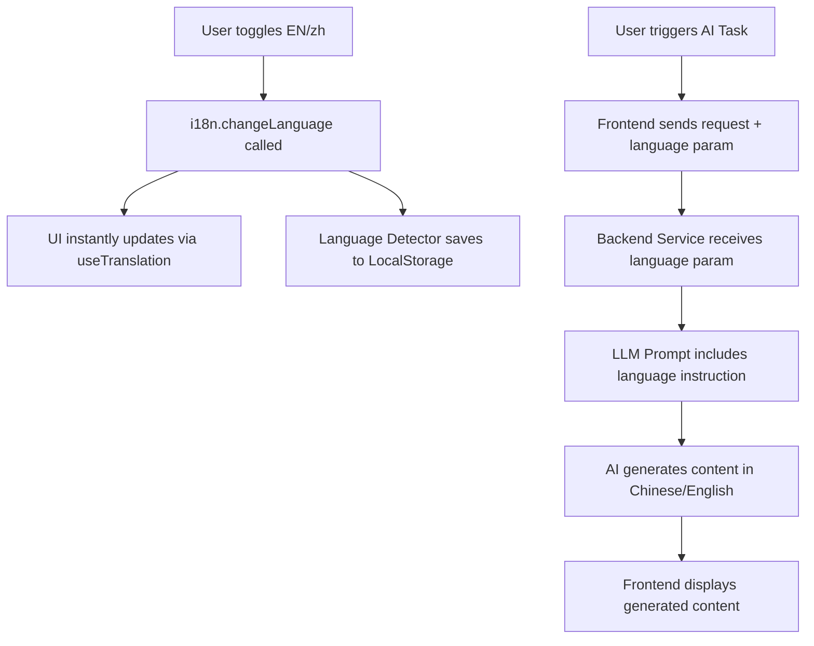

# Plan: Implementing Multi-language Support (English/Chinese) using react-i18next

This plan outlines the steps to add a language switch button to the top navigator and ensure both UI and AI-generated content (analysis, resumes, cover letters) support Chinese using the `react-i18next` library.

## 1. Frontend i18n Implementation (using react-i18next)

### A. Dependencies & Configuration
Install `i18next`, `react-i18next`, and `i18next-browser-languagedetector`.
Create `frontend/src/i18n.ts` (or similar path) to configure i18next.

### B. Translation Files
Organize translations into JSON files:
- `frontend/public/locales/en/translation.json`
- `frontend/public/locales/zh/translation.json`

Example `zh/translation.json`:
```json
{
  "nav": {
    "dashboard": "仪表盘",
    "brain": "经验库",
    "resumes": "简历管理",
    "stats": "统计"
  },
  "common": {
    "logout": "退出登录",
    "search": "搜索职位..."
  }
}
```

### C. Integration
- Wrap the app with `I18nextProvider` in `frontend/index.tsx`.
- Use the `useTranslation` hook in components:
  ```tsx
  const { t, i18n } = useTranslation();
  // ...
  <h1>{t('nav.dashboard')}</h1>
  ```

### D. UI Updates
- **Navbar**: Add a toggle button in `App.tsx` that calls `i18n.changeLanguage(newLang)`.
- **Persistance**: i18next-browser-languagedetector will handle saving the preference to `localStorage`.

### E. API Integration
Modify API requests to include the current language (`i18n.language`) in headers or request bodies.

## 2. Backend Support

### A. Schema Updates
Update `backend/app/api/v1/analyze.py` (and others):
- Add `language: Optional[str] = "en"` to Pydantic models for analysis and generation requests.

### B. Service Logic Updates
Update LLM prompts to respect the language preference:
- **Research Service**: Request the summary and culture analysis in the target language.
- **Writer Service**: Instructions for resume/cover letter generation must specify the target language.
- **RAG Service**: Matching reasoning and feedback should match the UI language.

## 3. Workflow Diagram



## 4. Proposed Steps

1.  **Environment Setup**: Install i18n packages in the frontend.
2.  **Configuration**: Initialize i18next and create initial JSON translation files.
3.  **Refactor UI**: Replace hardcoded English strings with `t()` calls in all components.
4.  **Language Toggle**: Implement the switch in the Navbar.
5.  **Backend API**: Add `language` field to relevant API endpoints.
6.  **AI Prompts**: Update LLM system prompts to handle the `language` parameter.
7.  **Frontend-Backend Link**: Pass `i18n.language` in all AI-related API calls.
8.  **Testing**: Verify UI translations and AI output language consistency.
